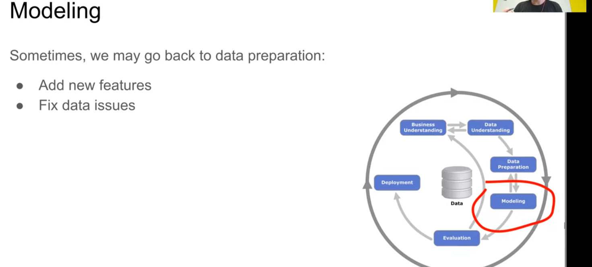
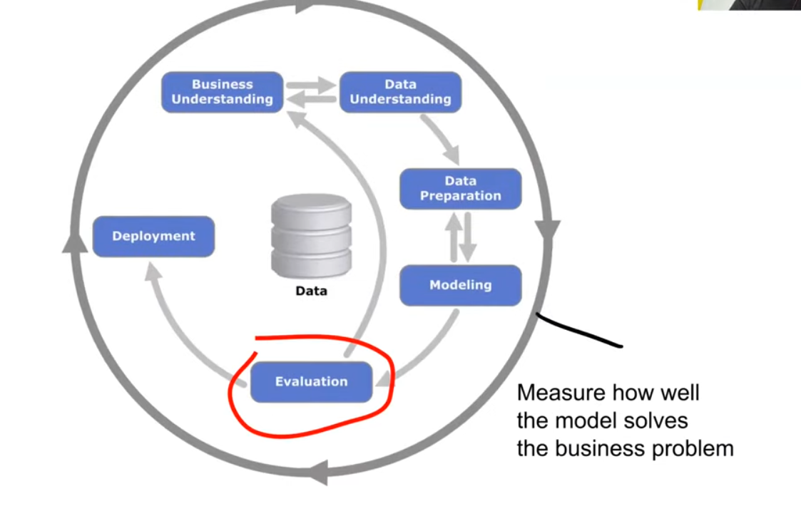
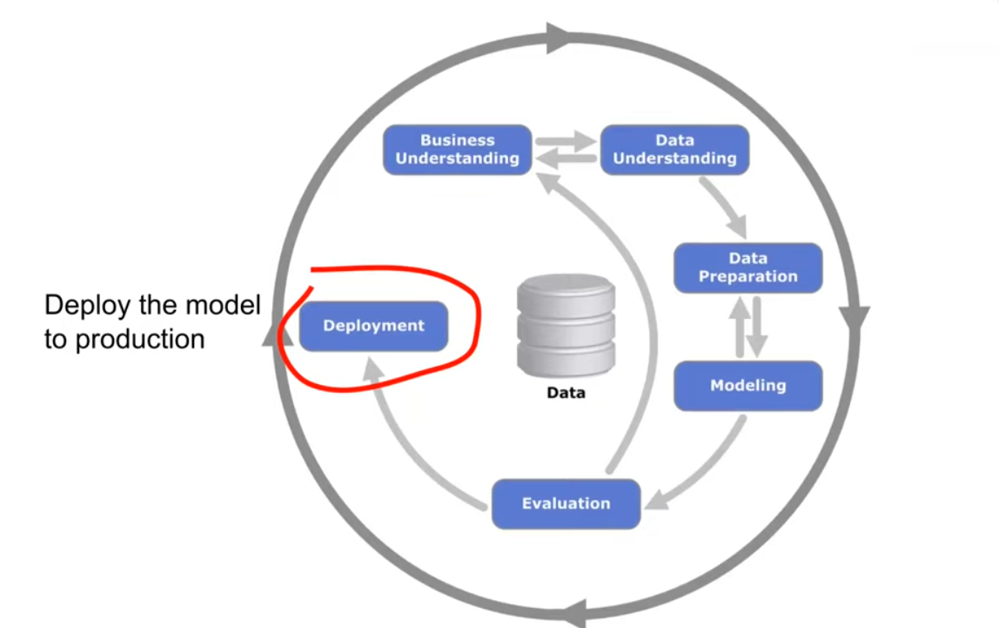

### CRISP-DM ML Process

- 
- CRISP-DM: cross industry standard process for data mining
- 
- 90s by IBM
- understand, firstly business
- 
- 
- how do we measure success?
- 
- 
- 
- 
- 
- example of data prep
- 
- 
- 
- 
- 
- 
- 
- 
- 
- 
- 
- 
- ALWAYS START SIMPLE AND LEARN FROM IMPROVEMENT
-
