### Vector Operations

- 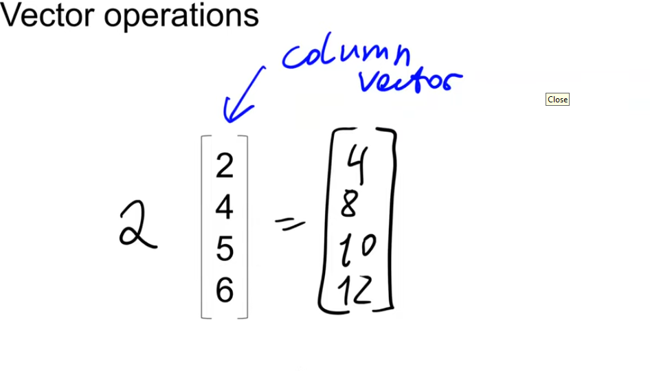

- 

- 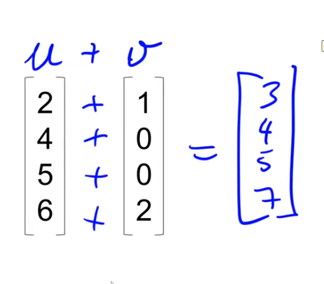

- that's acutally '8'

- 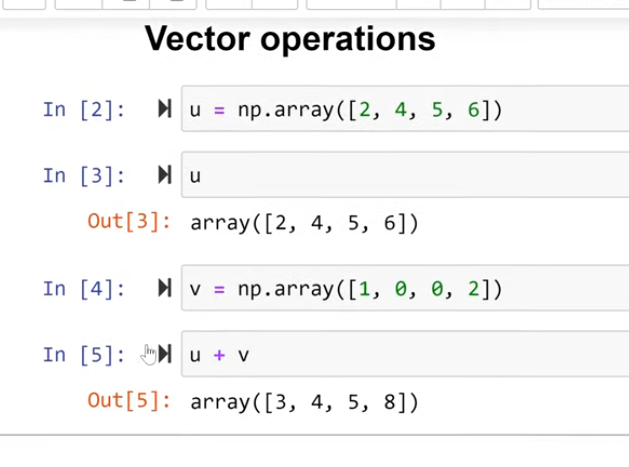

- multiplication (dot product)

- 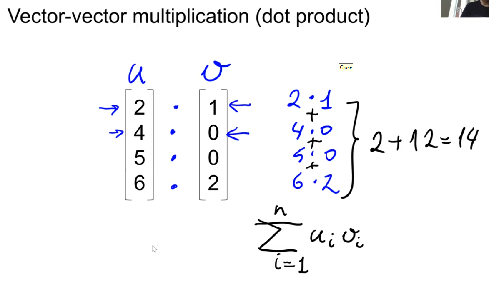

- transpose operation to transform column into rows

- 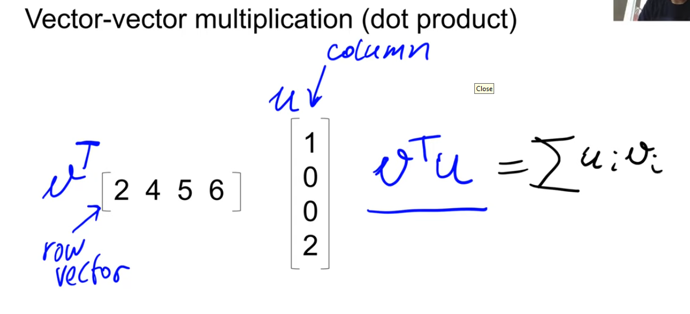

- ### matrix-vector multiplcation

- 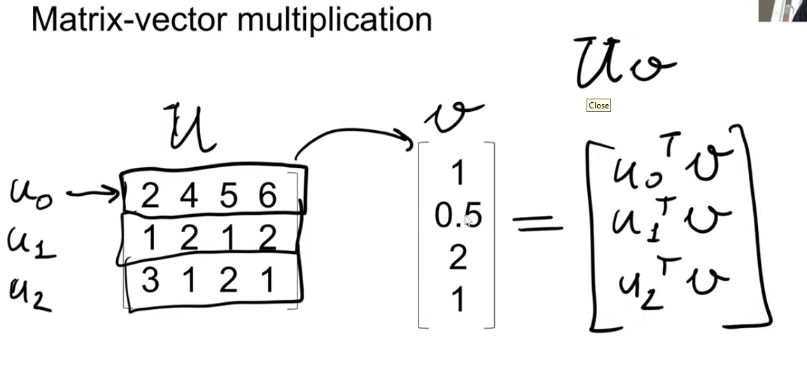

- 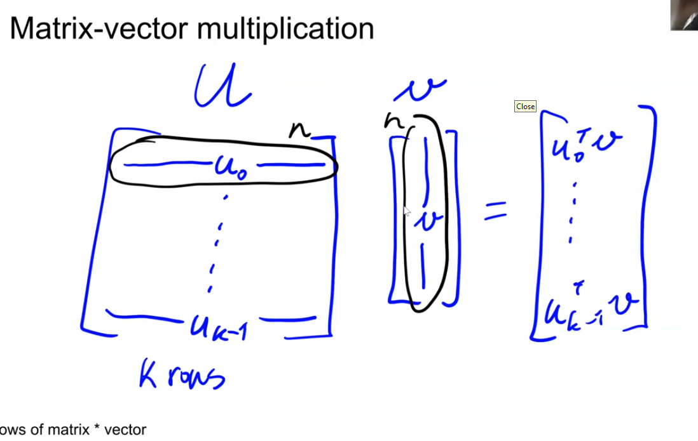

- number of columns in U should match number of rows in v

- ### matrix-matrix multiplication

- 

- 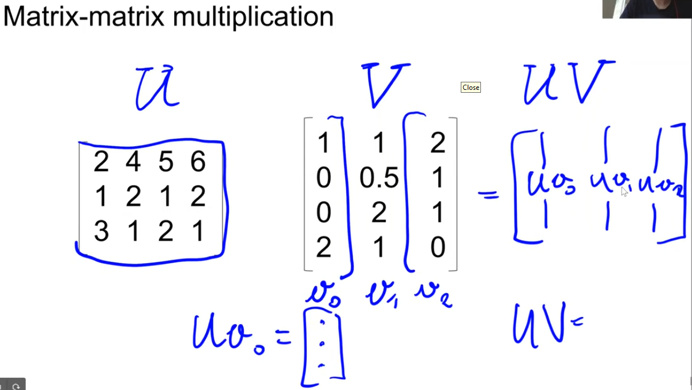

- implemented in python

- 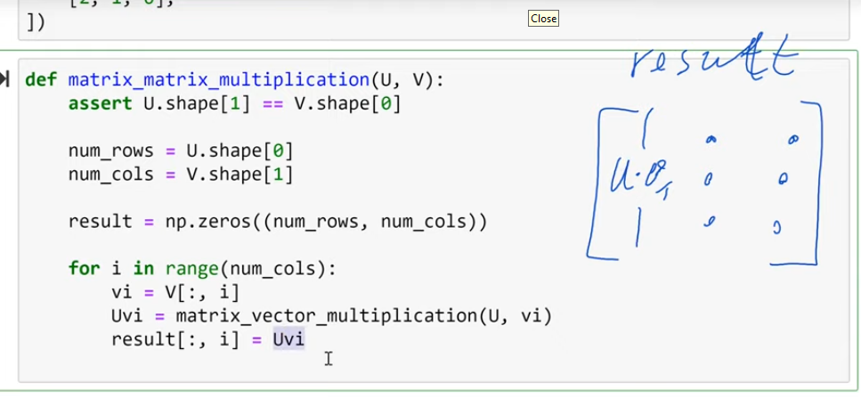

- ### identity matrics (I)

- 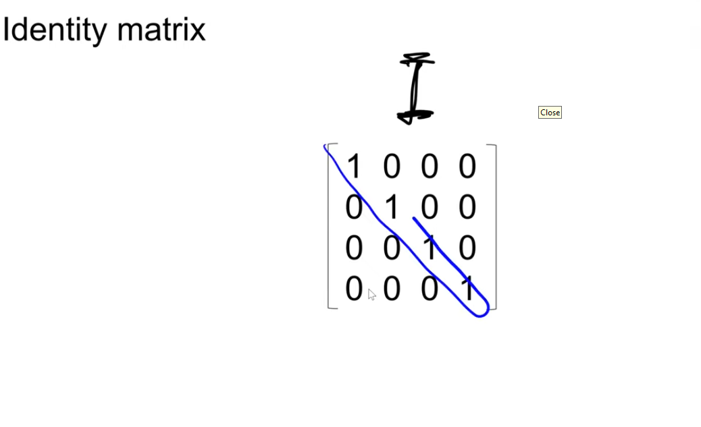

- 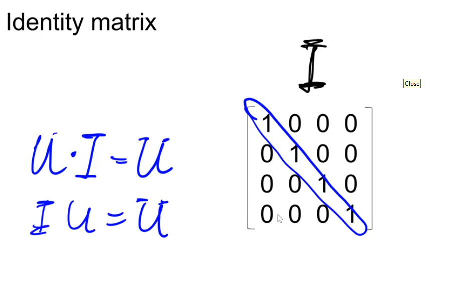

- 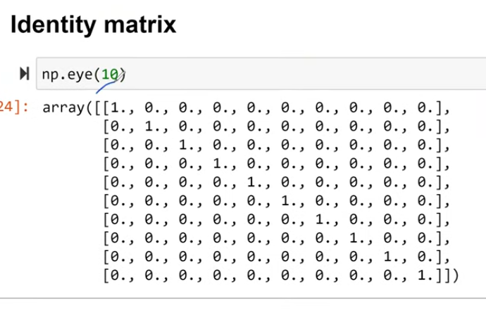

- useful for matrix inverse

- 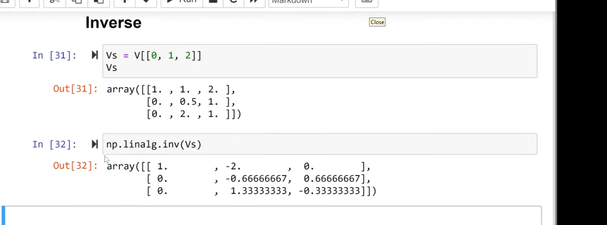

- 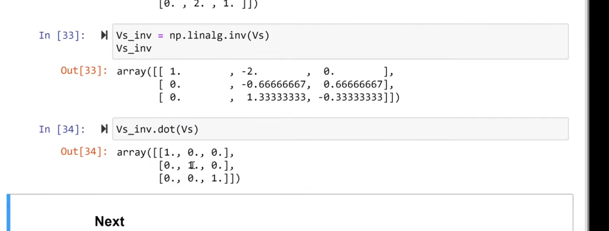

- useful for linear regression
