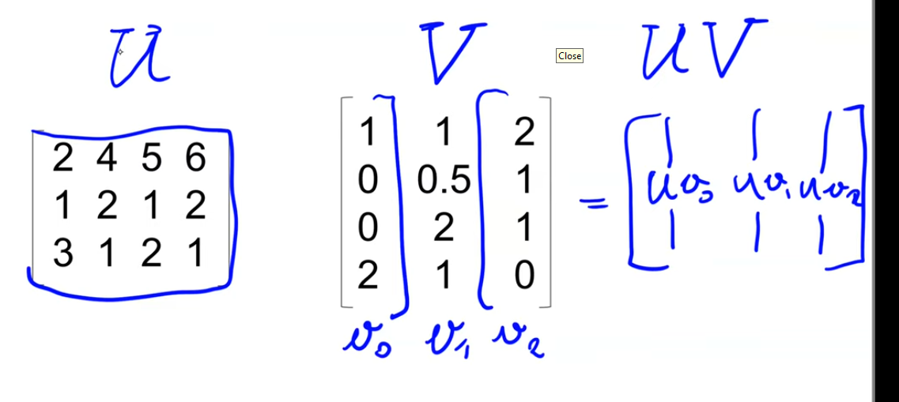

### Vector Operations

- 

- 

- 

- that's acutally '8'

- 

- multiplication (dot product)

- 

- transpose operation to transform column into rows

- 

- matrix-vector multiplcation

- 

- 

- number of columns in U should match number of rows in v

- matrix-matrix multiplication
  
  - 

