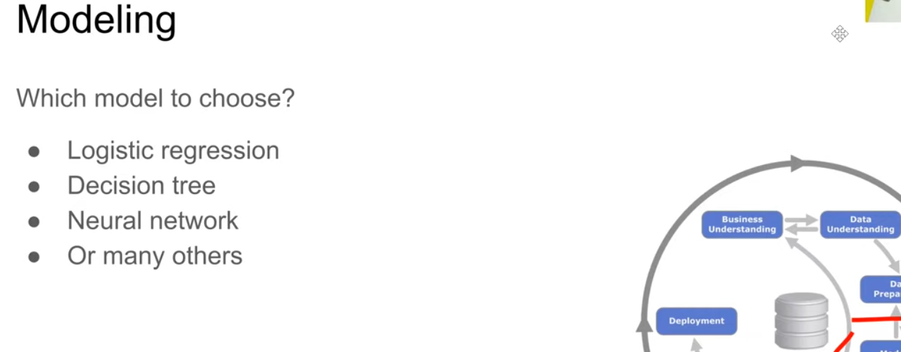
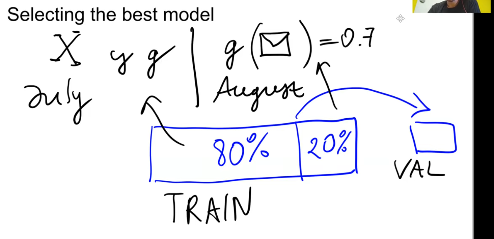
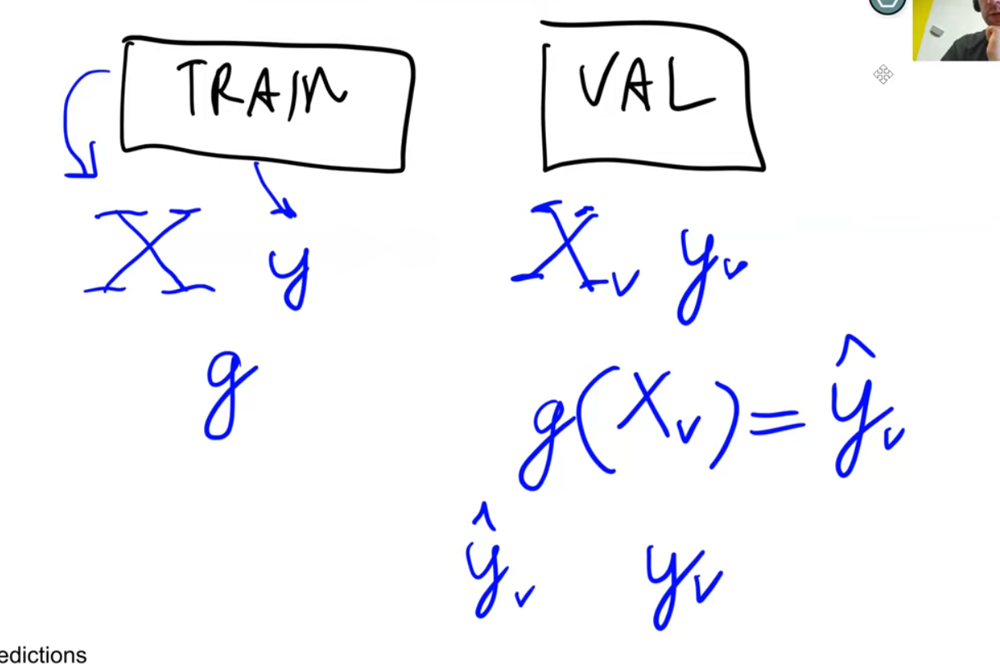
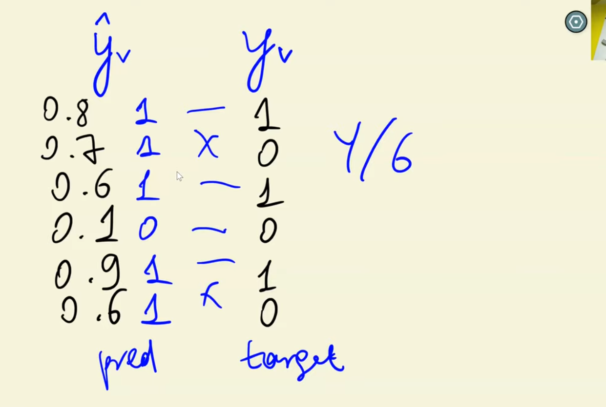
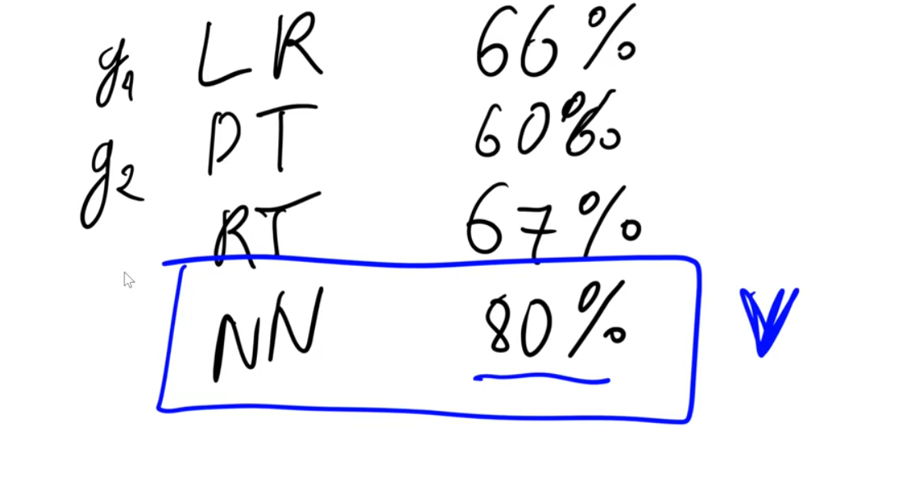
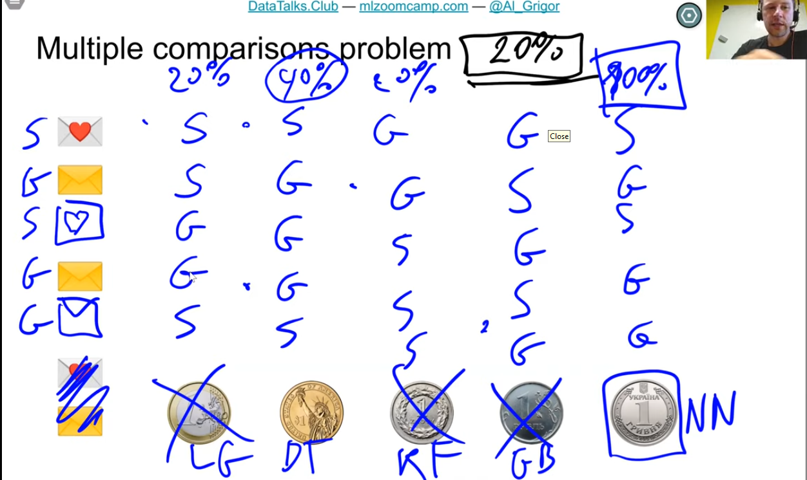
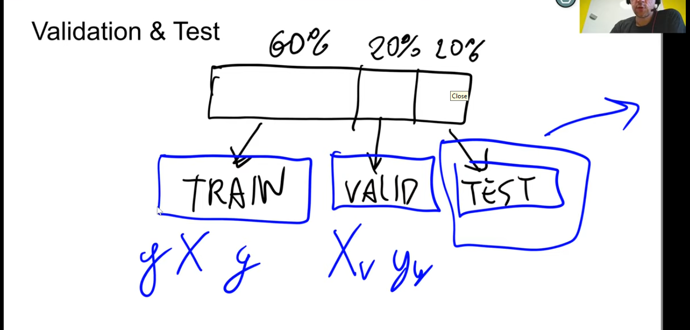
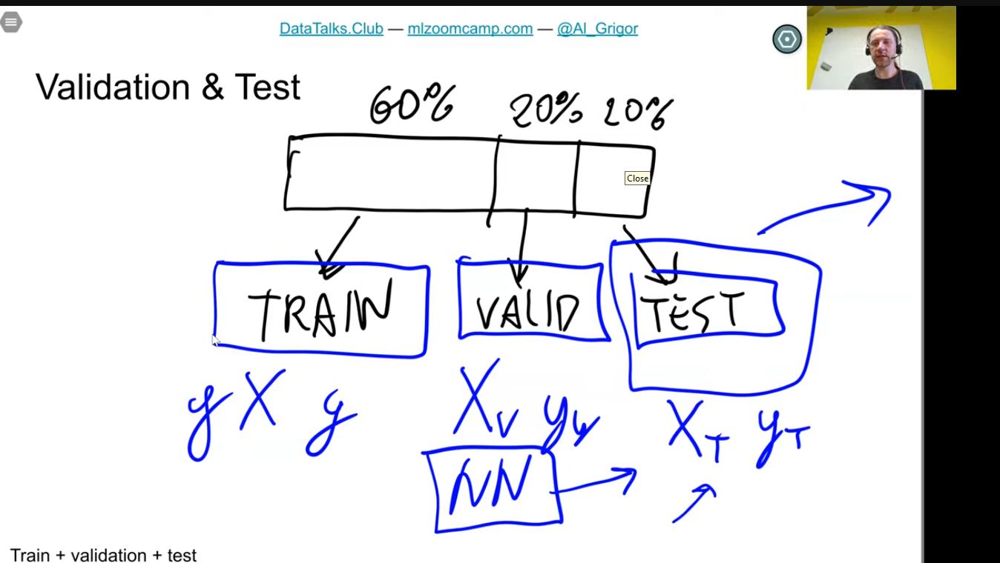
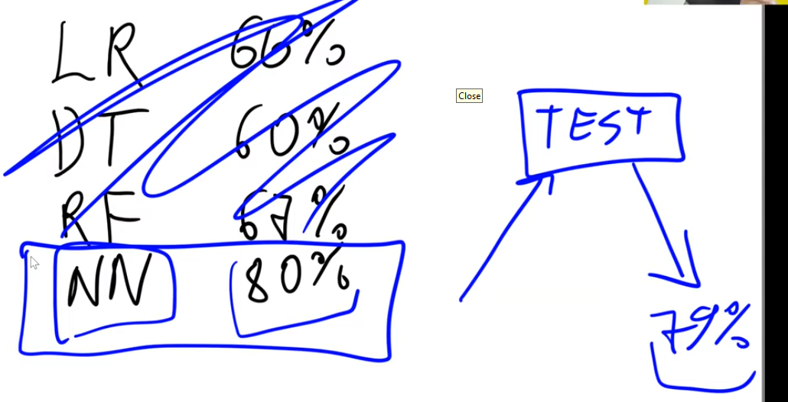
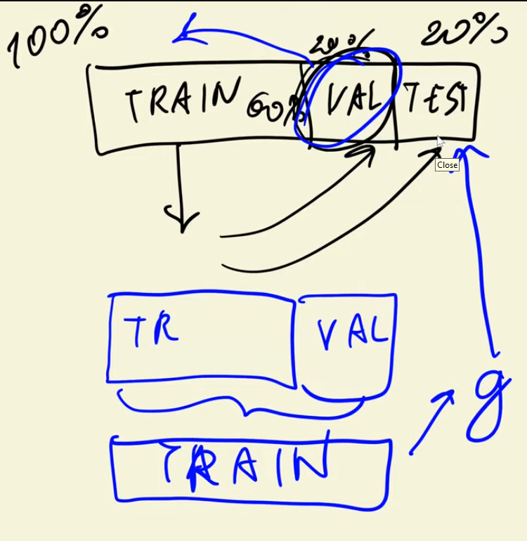

### Model Selection Process

- 

- 

- 

- 

- model above is 66% accurate

- can do this for logistic regresssion

- 

- 

- it's possible NN just got lucky (NN = neural net)

- but applying model to another dataset, it may not be correct

- multiple comparison problem

- ## Multiple comparison problem

The last table visualize a problem that could happen, when comparing

different models on one validation dataset. The winning model could just

get lucky (like a coin-flip) predicting the validation data. When

testing the models on a totally different dataset, the winner could be

another model.

3 subsets of data: train, validation, and test (hide)

apply NN (winning model) to the test dataset

- extra round of validation

logisitc regression, decision tree, neural net, random forest

