<<<<<<< HEAD

- kaggle dataset

- 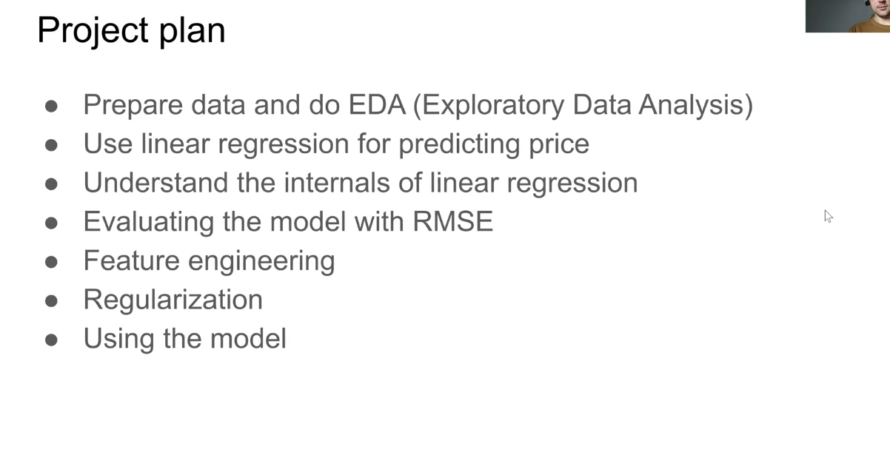

- github.com/alexeygrigorev/mlbookcamp-code/tree/master/chapter-02-car-price

- 

- 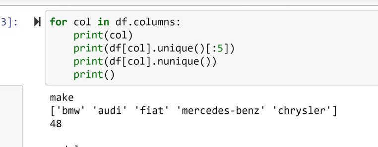

- 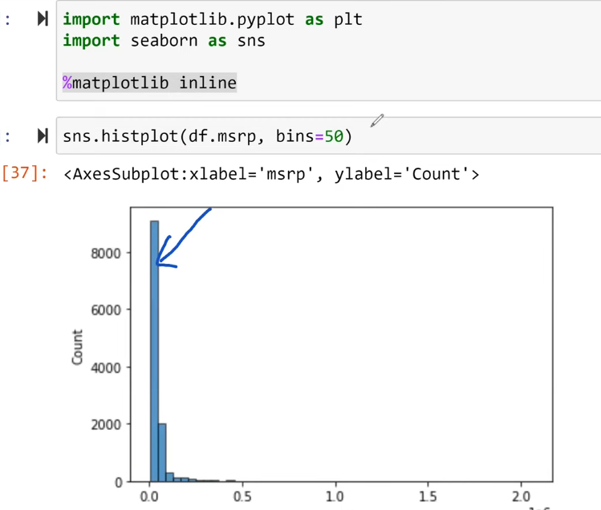

- bins is number of bars
  =======

- [GitHub - alexeygrigorev/mlbookcamp-code: The code from the Machine Learning Bookcamp book](https://github.com/alexeygrigorev/mlbookcamp-code/tree/master)

- 

### Data Preparation

- `pd.read_csv(<file_path_string>)` -> read csv files

- `df.head()` -> take a look of the dataframe

- `df.columns` -> retrieve colum names of a dataframe

- `df.columns.str.lower()` -> lowercase all the letters

- `df.columns.str.replace(' ', '_')` -> replace the space separator

- `df.dtypes` -> retrieve data types of all features

- `df.index` -> retrieve indices of a dataframe

> > > > > > > 3ce12367d92304b32fb033f5d0210f30c4de5a1b

- np.log([0 + 1,1+ 10, 1+ 1000,1 + 100000])

- logs git rid of long-tail distributions

- 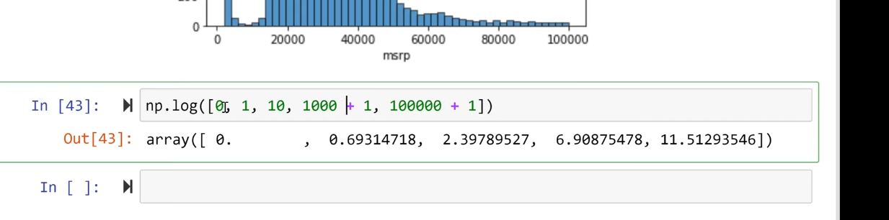

- np.log1p -- adds 1 to each value for log

- 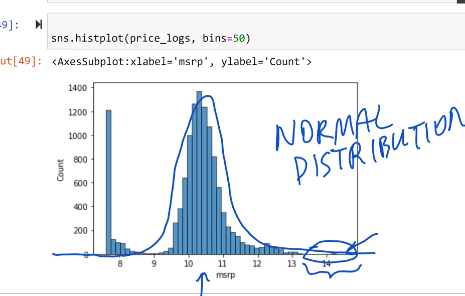

- models are better when trying to predict normal distributions

- long-tails confuse models

- checking to see if value in cell is null or not

- 

### Setting up Validation Framework

- 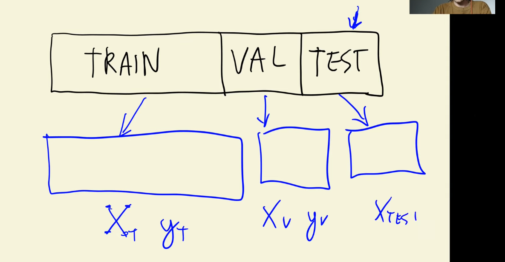

- slicing dataframe

- 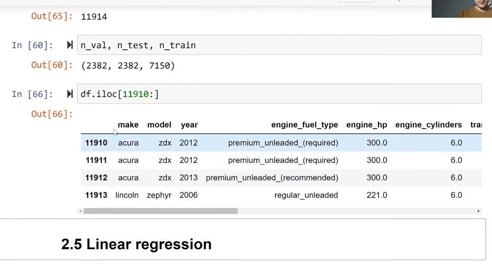

- shuffl with a shuffled array

- 

- 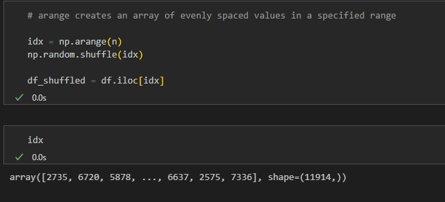

- 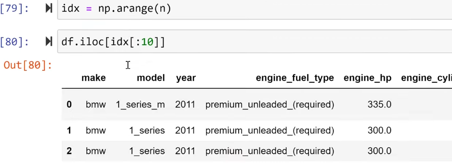

### Linear Regression

- 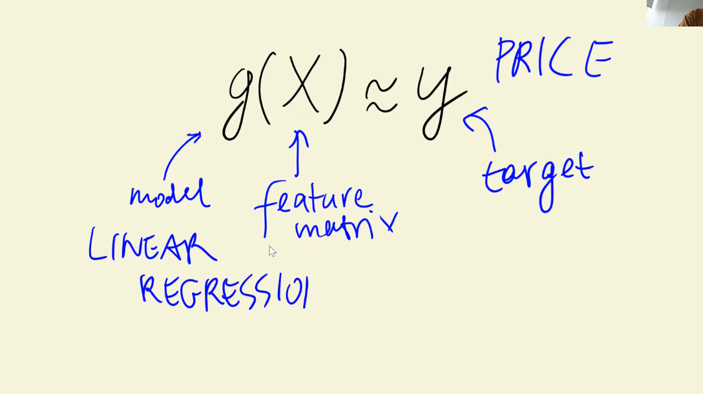

- 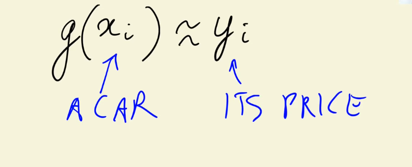

- 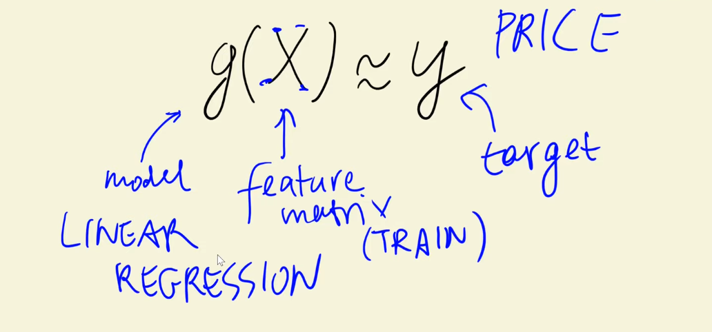

- 

- 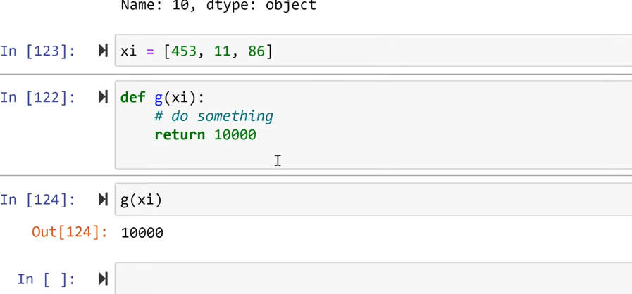

- linear regression formula

- 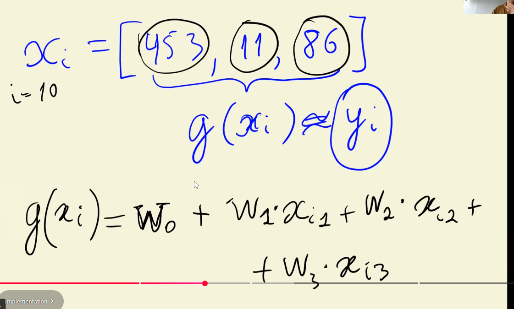

- 
